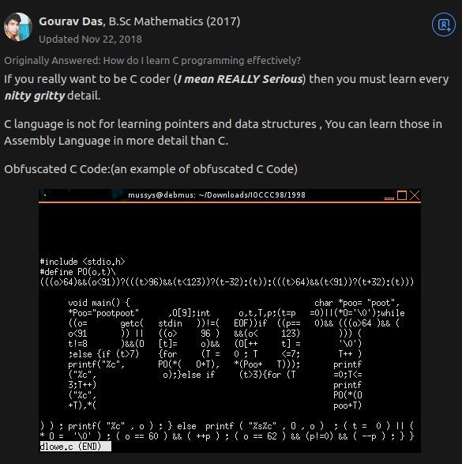

In the Name of Allah, the All Merciful, The All Compassionate.

> So... I guess I'm doing this, huh?

Well, before I start, here's the "why" of this:

In simple words:

I stumbled into a problem, and googled for how I can either solve it, or work around it. I found a solution that fixes my exact problem, but... I couldn't understand a single line of it :expressionless: (The solution was all in C).

This kept happening, so I decided:

> Well, I guess I'm learning C/C++ ¯\_(ツ)_/¯
	
Before I begin though, I would like to give credit to this amazing response on Quora that helped me begin this...

<a href="https://qr.ae/pGBkBG">

</a>

