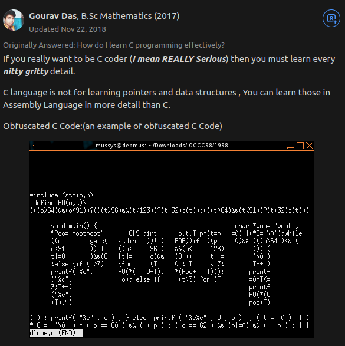

In the Name of Allah, the All Merciful, The All Compassionate.

Before I start, here's the "why" of this:

In simple words:

I stumbled into a problem, and googled for how I can either solve it, or work around it. I found a solution that fixes my exact problem, but... I couldn't understand a single line of it :expressionless: (The solution was all in C).

This kept happening, so I decided:

> Well, I guess I'm learning C/C++ ¯\_(ツ)_/¯
	
Before I begin though, I would like to give credit to this amazing response on Quora that helped me begin this...

<a href="https://qr.ae/pGBkBG">

</a>

The resources I used come from various sources, but I will try my best to list them and credit the respective owners.
I don't really know if this is a good idea or a dumb one, but I think if I record my journey thoroughly, I may be able to help at least _someone_

In any case, to the person reading this, I wish you luck on your journey, may you find this record helpful. :smile:

