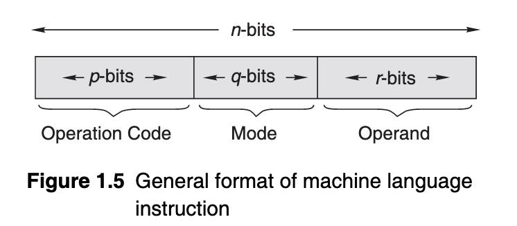
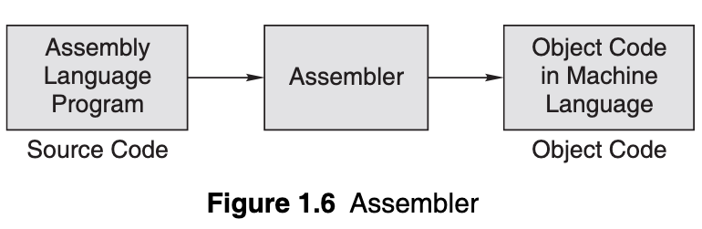

# Day: 1

In the name of Allah, The most Kind, The Most Merciful.

> Behold! The first day of my journey, may it serve as a reference point for anyone who wants to begin as I did.

After some rummaging through resource lists, I concluded that the book: "Programming in C: Second Edition" by Pradip Dey and Manas Ghosh, is the best starting point.

Although I have a strong foundation in programming concepts at the time of writing this, I believe that it'll do me no harm on reading the first chapter:
"INTRODUCTION TO PROGRAMMING, ALGORITHMS AND FLOWCHARTS". I will be noting down important stuff, as well as my observations and ideas as I read the chapter, below:

## Introduction to Programming, Algorithms and Flowcharts

***Definition***: _A program is a set of logically related instructions that is arranged in a sequence that directs the computer in solving a problem._

 - Computer software can be broadly classified into two categories:
    - system software
    - application software

***

### System Software

***Definition*** :  _System software is a collection of programs that interfaces  
with the hardware._

System Software can be classified into the following types:
- Language Translator[^1]
- Operating System[^2]
- Utilities
- Special Purpose Programs

***

### Application Software

***Definition*** :  _Application software is written to enable the computer to solve a specific data processing task._

There are two types of this kind of software:
- Pre-written software packages
- User Application programs

In simpler words, the book tells us that the first category, i.e. Pre-written software programs serve as a foundation for users to build their own applications, i.e User Application programs.

***

### Programming Languages

As the book puts it: _A programming language is composed of a set of instructions in a language understandable to the programmer and recognisable by a computer._

This is quite incomplete as is, but it serves the basic purpose of telling a person new to programming what _programming languages_[^3] are. A more complete description is:

_A programming language is any set of rules that converts [strings](https://en.wikipedia.org/wiki/Formal_language#Words_over_an_alphabet "Formal language"), or [graphical](https://en.wikipedia.org/wiki/Computer_graphics "Computer graphics") [program](https://en.wikipedia.org/wiki/Computer_program "Computer program") elements in the case of [visual programming languages](https://en.wikipedia.org/wiki/Visual_programming_language "Visual programming language"), to various kinds of [machine code output](https://en.wikipedia.org/wiki/Machine_code "Machine code")._

A programming language can be classified into the following types:

- High-level programming language; eg: Python, Dart, Go, Rust, Java … etc
- Middle-level programming language; eg: C/C++.
- Low-level programming language; eg: Assembly.

Assembly language, which has a one-to-one correspondence with machine code, was the normal choice or writing system programs like operating systems. But, today C is widely used to develop system software.

***

### Low-level Programming Languages

***Definition*** : _A low-level computer programming language is one that is closer to the native language of the computer, which is 1’s and 0’s._

Now, we look into the most basic mode of instruction we can use:

Machine Language

+ This is a sequence of instructions written in the form of binary numbers consisting of 1’s and 0’s to which the computer responds directly.

+ The machine language is also referred to as the machine code, although the term is used more broadly to refer to any program text.

A machine language instruction generally has three parts as shown in Fig. 1.5.

The diagram shows three, but in reality there's three _sections_ of a command, i.e. the first specifying the **operation**, the second specifying the **Mode** and the third specifying the **operand**.

The command as a whole, is divided into two _parts_:

- The first part is the command or operation code that conveys to the computer what function has to be performed by the instruction. All computers have operation codes for functions such as adding, subtracting and moving.

- The second part of the instruction either specifies that the operand contains data on which the operation has to be performed or it specifies that the operand contains a location, the contents of which have to be subjected to the operation.

      Machine language is considered to be the first generation language (1GL).

Here's the advantages and disadvantages of assembly language:

| Advantages              | Disadvantages                 |
|:-----------------------:|:-----------------------------:|
| Very Fast               | Machine Dependent             |
| Efficient               | Difficult to use              |
| No translation required | Error Prone                   |
|                         | Difficult to debug and modify |

Now, as is clearly seen, the machine language is way too impractical to use. Thus, it is Assembly language we come to next.

***Definition***: _When symbols such as letters, digits, or special characters are employed for the operation, operand, and other parts of the instruction code, the representation is called an assembly language instruction. Such representations are known as mnemonic codes; they are used instead of binary codes._

_mnemonic codes_ is just a fancy way to say "_aliases_ for something", like _short-forms_.

       Assembly language is considered to be the second generation language (2GL).

Machine and assembly languages are referred to as low-level languages since the coding for a problem is at the individual instruction level.  Each computer has its own assembly language that is dependent upon the internal architecture of the processor.

***Definition*** : _An   **assembler**   is a translator that takes input in the form of the assembly language program and produces machine language code as its output._

An assembly language program cannot be executed by a machine directly as it is not in a binary machine language form. An assembler is needed to translate an assembly language program into the object code, which can then be
executed by the machine. The object code is the machine language code.

**Advantages of Assembly Language**: It makes it simpler compared to machine language to write instructions to a computer.

**Disadvantages of Assembly Language**:
- Machine Specific
- Difficult and Time Consuming
- The programmer should know all about the logical  structure of the computer.

All in all, the problem with assembly language is that it didn't solve as many problems that were found in machine language, i.e. the problems like being difficult to learn and being machine specific.

What assembly language bring about, though, was the abstraction of instructions which led to more languages doing similar stuff.

I believe it's best to end "Day: 1" at this.
Cheers! 🎊

[^1]: _It is a system software that  transforms a computer program written by a user into a form that can be understood by the machine_
[^2]: _An operating system manages the computer’s resources effectively, takes care of scheduling multiple jobs for execution, and manages the flow of data and instructions between the input/output units and the main memory._
[^3]: The definition is taken from a [wikipedia article](https://en.wikipedia.org/wiki/Programming_language) by [CrunchyVersusTheRabbit](https://en.wikipedia.org/wiki/User:CrunchyVersusTheRabbit "User:CrunchyVersusTheRabbit") - 18:01, 25 January 2022
