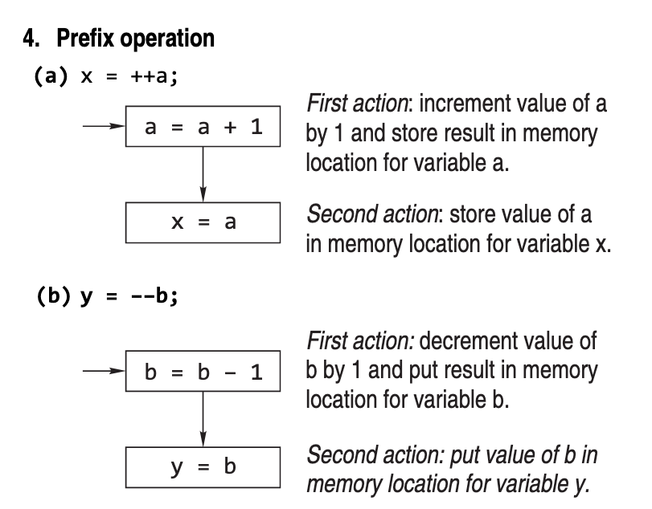

# Day 8

In the Name of Allah, The Originator, The Fashioner

## How does a Computer Store data in memory

The _word size_ is the computer’s preferred size for moving units of information around; technically it’s the width of your processor’s _registers_, which are the holding areas your processor uses to do arithmetic and logical calculations.
The computer views your memory as a sequence of words numbered from zero up to some large value dependent on your memory size.


### How Are Integers Stored?

Storing **unsigned integers** is a straightforward process. _The number is changed to the corresponding binary form and the binary representation is stored._

For **signed integer** types, the bits of the object representation shall be divided into three groups: 
- _value bits_: Represent the _absolute value_ of the signed integer.
- _padding bits_: Used to pad the binary representation so that it takes up the specified space.
- _sign bit_: Used to indicate the sign of the number.

There need not be any padding bits; there shall be _exactly one sign bit_. 
Each bit that is a value bit shall have the same value as the same bit in the object representation of the corresponding unsigned type (if there are M value bits in the signed type and N in the unsigned type, then M ≤ N).

If the sign bit is 0, it shall not affect the resulting value. If the sign bit is 1, the value shall be modified in one of the following ways:
+ the corresponding value with sign bit 0 is negated (sign and magnitude);
+ the sign bit has the value −(2N) (2’s complement);
+ the sign bit has the value −(2N − 1) (1’s complement). 


***NOTE***: _In the case of sign and magnitude and ones’ complement, if this representation is a normal value it is called a negative zero._

### Sign And Magnitude

_In this method, one bit (the left-most) represents sign bit, 0 for positive and 1 for negative. The leftover bits of the word represents the absolute value of the number._

Therefore, the maximum positive value is one half of the unsigned value. There are two zero values, a plus zero and a minus zero. **This method is not used to store values in today’s computer.**

> If it's not used, why do you teach it? 
> > Because learning about older methods helps you understand newer ones based off of the old ones.


### One's Complement

In this method, negative numbers are stored in their complemented format. Like sign and magnitude form the 1’s complement has two zero values (plus zero and minus zero).

**Like sign and magnitude method, this method is not used in general purpose computers**


### Two's Complement form

All bits change when sign of the number changes. So the whole number, not just the most signi ficant bit, takes part in the negation processes. However, we have only one 0.

0 and –1 are complement of each other. Likewise +32767 and –32768 are the complement to each other.


### How Floats and Doubles are stored

Floats and doubles are stored in mantissa and exponent forms except that instead of the exponent representing the power of 10, it represents a power of 2, since base 2 is the computer’s natural format.
The number of bytes used to represent a floating-point number depends on the precision of the variable. `float` is used to declare single-precision variables, whereas the type `double` denotes double-precision values.


The representation of the mantissa and exponent in these variables is in accordance with the IEEE floating-point standards.[^1]
The IEEE format expresses a floating-point number in a binary form known as a **normalized form**. 
Normalization involves adjusting the exponent so that the _binary point_ (the binary analog of the decimal point) in the mantissa always lies to the right of most significant non-zero digit. _In binary representation, this means that the most significant digit of the mantissa is always 1_.

> next few paragraph are too boring for me, skipping and saving for later :P


## Tokens

***Definition***: _Tokens are the basic lexical building blocks of source code. In other words, one or more symbols understood by the compiler that help it interpret your code._

There are five classes of tokens: 
- **Identifiers**: An identifier is a sequence of characters invented by the programmer to identify or name a speci fic object and name is formed by a sequence of letters, digits, and underscores.

- **Reserved Words**: Keywords are explicitly reserved words that have a strict meaning as individual tokens to the compiler. They cannot be redefined or used in other contexts.

- **Operators**: Operators are tokens used to indicate an action to be taken. Operators can be single characters, or be compound operators conssisting of multiple characters. 

- **Separators**: Separators are tokens used to separate other tokens. Two common kinds of separators are indicators of an end of an instruction and separators used for grouping.

- **Constants**: A constant is an entity that doesn’t change.


### Identifier

Rules for defining an identifier in C:

- Identifier names are unique.
- Cannot use a keyword as identifiers.
- Identifier has to begin with a letter or underscore (_).
- It should not contain white space.
- Special characters are not allowed.
- Identifiers can consist of only letters, digits, or underscore.
- Only 31 characters are significant.
- They are case sensitive.

```c
int _integer = 10; 		  // CORRECT
int integer_ = 10;       // CORRECT
int age_of_grandpa = 78; // CORRECT

float __some_random_float = 129873.123123; // CORRECT

char @character = 'a'; // INCORRECT 
char &O = 'O'; 			// INCORRECT


double double_precis0n = 1.2123123123123; // INCORRECT
float floating point = 1001.123; // INCORRECT


int this_is_a_very_long_name_for_a_variable_so_only_first_thirty_one_characters_are_significant = 1; // CORRECT but only first 31 characters are significant.
```

### Keywords

Keywords are the vocabulary of C. Because they are special to C, one can’t use them for variable names.

There are _32_ words de fined as keywords in C. These have prede fined uses and cannot be used for any other purpose in a C program. They are used by the compiler to compile the program. They are always written in lowercase letters.


***Note that compiler vendors (like Microsoft, Borland, etc.) provide their own keywords apart from the ones mentioned above. These include extended keywords like near, far, asm, etc. Though it has been suggested by the ANSI committee that every such compiler specific keyword should be preceded by two underscores (as in __asm), not every vendor follows this rule.***


### Constant

A constant is an explicit data value written by the programmer. Thus, it is a value known to the compiler at compiling time. The compiler may deal with this value in any of several ways, depending on the type of constant and its context.

_C permits integer constants, floating-point constants, character constants, and string constants._

In ANSI C, a decimal integer constant is treated as an unsigned long if its magnitude exceeds that of the signed long. An octal or hexadecimal integer that exceeds the limit of int is taken to be unsigned; if it exceeds this limit, it is taken to be long; and if it exceeds this limit, it is treated as an unsigned long.


A character constant normally consists of a single character enclosed in single quotes. Example: 'b' and '^' are both character constants.
Every character can be mapped onto a unique unsigned int, we will henceforth assume that ASCII code of character representation is used.
So, 'A' and 'a' are equivalent to 41 and 97 respectivelty.

Here's the complete ASCII table:


To use octal ASCII representation, we can append a '\0' at the beginning of the octal ASCII code. For example:

```c
char terminal_bell = ‘\07’;
	/* 7 = octal ASCII code for beep */
	
char backspace = ‘\010’;
	/* 10 = octal code for backspace */
```

For ANSI C compilers, character constants may be defined by hex digits instead of octals. Hex digits are preceded by x, unlike 0 in the case of octals. For example:

```c
char backspace = ‘\xA’;
	/* A = hexadecimal ASCII code for backspace */
```

Any number of digits may be written but the value stored is undefined if the resulting character value exceeds the limit of `char`.

Note that the character constant ‘ a’ is not the same as the string “a”. A string is really an array of characters that is a bunch of characters stored in consecutive memory locations, the last location containing the null character; so the string “a” really contains twochars, an ‘a’ immediately followed by ‘\0’.

_Essentially, a string is a **null terminated array of characters**._

The length of a character string is the number of characters in it (again, excluding the surrounding double quotes). Thus, the string “messagen” has a length of eight. _The actual number of stored characters is one more as a null character is added._


A long string may extend beyond a single line, in which case each of the preceding lines should be terminated by a backslash. For example,

```
“Example to show \
the use of backslash for \
writing a long string”
```

The backslash in this context means that the rest of the string is continued on the next line. The preceding string is equivalent to the single-line string

```
“Example to show the use of backslash for writing a long string”
```


More than one \n can be used within a string enabling multi-line output to be produced with a single use of the `printf()` function. Here’s an example:

```c
int main() {

	printf(“This sentence will \n be printed\nin \
	multi-line \n”);
	
	return 0;
}
```

When the program was compiled and run it produced
the following output.

```console
This sentence will
be printed
in multi-line
```

The indenting spaces at the start of the string continuation being taken as part of the string. A better approach is to use string concatenation which means that _two strings which are only separated by whitespaces are regarded by the compiler as a single string._ `Space, newline, tab character and comment are collectively known as whitespace.` Here's an example to demonstrate this:

```c
int main() {
	printf(“hello,” “world\n”);
	return 0;
}
```


### Assignment

The general form of the assignment statement is:

```
variable_name = expression;
```

`=` is known as the assignment operator. _The assignment operator replaces the content of the location ‘i’ with the evaluated value of the expression on its right-hand side_

The assignment also acts as an expression that returns the newly assigned value. Some programmers use the feature to write statements like the following:

```c
y = (x = 2 * x);
```
This statement puts x’s new value in y. The operand to the left of the assignment operator must be a variable name.

C does not allow any expression, constant, or function to be placed to the left of the assignment operator. Thus, its left operand should be a variable and its right operand may be an arbitrary expression.

***NOTE***: Assigning values to _expressions_ is an illegal operation in C.


### Initialization

When a variable is declared, the C compiler does not assign any value to the variable, unless it is instructed to do so. Such declaration is called a _tentative declaration_. For example:

```c
int i; /* This declaration is tentative */

int x;
x = i + 5; /* variable i is not assigned any known value, and therefore the value of x is undefined. This is a bug */
```

To prevent such pitfalls, always assign a value to the variable during the declaration of variables. This is known as _initialization_. The value of initialization is called the _initializer_.

The general form of the initialization statement is:

```c
	// <data_type> variable_name = constant;
	// example:
	int i = 100; /* 100 is an initializer */
```

### Operators and Expressions

***Definition***: _An operator is a symbol that speci fies the mathematical, logical, or relational operation to be performed._ 

***Definition***: _An expression is any computation that yields a value._


#### Arithmetic Operators

There are three types of arithmetic operators in C: binary, unary, and ternary.

**Binray Operators**: C provides five basic arithmetic binary operators.


Except for remainder (%), all other arithmetic operators can accept a mix of integer and real operands. Generally, _if both operands are integers, the result will be an integer_. However, _if one or both of the operands are reals, the result will be a real (or double to be exact)._

**Unary operators**: The unary ‘–’ operator negates the value of its operand (clearly, a signed number). A numeric constant is assumed positive unless it is preceded by the negative operator. That is, there is no unary ‘+’. It is implicit.

Note that _-x_ does not change the value of _x_ at the location where it permanently resides in memory.

**Unary increment and decrement operators**: e unary ‘++’ and ‘--’ operators increment or decrement the value in a variable by 1
These operatos come in _'pre'_ and _'post'_ variants:

- _`var++`, `var--`_: _‘post’_ variants for increment and decrement respectively.
- _`++var`, `--var`_: _‘pre’_ variants forincrement and decrement respectively.


**NOTE**: _It is to be noted that `i++` executes faster than `i = i + 1` because the expression `i++` requires a single machine instruction such as INR to carry out the increment operation whereas `i = i + 1` requires more instructions to carry out this operation._

Here is a diagramatic representation of how prefix and postfix operations work:





To clarify this further, here's the algorithm for pre-increment operation:

_Suppose `a = 10` and `b = ++a`_

1. Increment `a` (So `a == 11`)
2. Assign value of `a` to `b` (So `b == 11`)
3. Result is: `a == b == 11`

For post-increment operation:

_Suppose `a = 10` and `b = a++`_

1. Assign value of `a` to `b` (So `b == 10`)
2. Increment `a` (So `a == 11`)
3. Result is: `a == 11` and `b == 10`


**Abbreviated (compound) assignment expressions**: It is frequently necessary in computer programs to make assignments such as: 

```c
n = n + 5;
```

C allows a shorter form for such statements, as shown:

```c
n += 5;
```

Assignment expressions for other arithmetic operations may be similarly abbreviated as shown:

```c
n –= 5; /* is equivalent to n = n – 5; */
n *= 5; /* is equivalent to n = n * 5; */
n /= 5; /* is equivalent to n = n / 5; */
n %= 5; /* is equivalent to n = n % 5; */
```

[^1]: [IEEE 754-1985](https://en.wikipedia.org/wiki/IEEE_754-1985)

