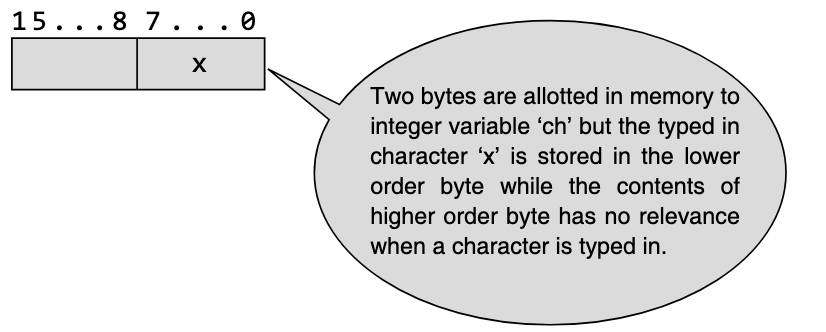
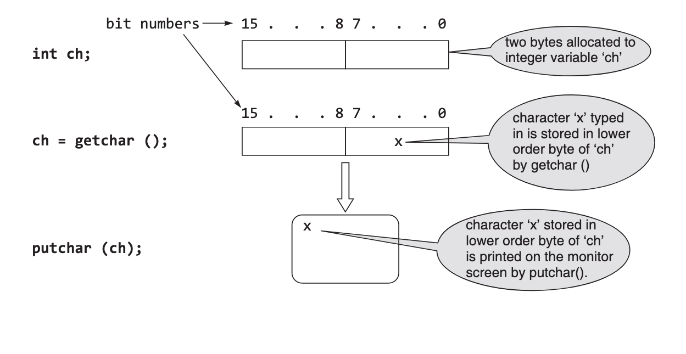

# Day 11

In the Name of Allah, Possessor of Glory and Honour, Lord of Majesty and Generosity.


## Input and Output (I/O)


### Basic Screen and Keyboard I/O in C


C provides several functions that give different levels of input and output capability. These functions are, in most cases, implemented as routines that call lower-level input/output functions.

The input and output functions in C are built around the concept of a set of _standard data streams_ being connected from each executing program to the basic input/output devices. 

These _standard data streams_ or files are opened by the operating system and are available to every C and assembler program for use without having to open or close the files. These standard files or streams are: 

- `stdin`  : connected to the keyboard.
- `stdout` : connected to the screen.
- `stderr` : connected to the screen.

The following two data streams are also available on MSDOS-based computers, but not on UNIX or other multi-user-based operating systems:

- `stdaux` : connected to the first serial communications port.
- `stdprn` : connected to the first parallel printer port.

The `<stdio.h>` header file contains the various declarations necessary for the functions, together with the macros and type declarations needed for the input and output functions. 

The input/output functions fall into two categories: 

- **non-formatted** read (input) and display (output) functions
- **formatted** read (input) and display (output) functions


### Non-Formatted I/O

Non-formatted input and output can be carried out by standard input-output library functions in C. These can handle one character at a time. For the input functions it does not require `<Enter>` to be pressed after the entry of the character. For output functions, it prints a single character on the console.

### Single Character I/O

A number of functions provide for character-oriented input and output. The declarations format of two of these are given as follows:

```c
int getchar(void); //function for character input

int putchar(int c); //function of character output
```

- `getchar()` is an input function that reads a single character from the standard input device, normally a keyboard. 

- `putchar()` is an output function that writes a single character on the standard output device, the display screen.


There are two other functions, `gets()` and `puts()`, that are used to read and write strings from and to the keyboard and the display screen respectively.

### Single Character Input

The `getchar()` input function reads an unsigned char from the input stream: `stdin`. The character, obtained from the input stream, is treated as an `unsigned char` and is converted to an `int`, which is the return value. 

On `End of File`, the constant `EOF` is returned, and the end-of-file indicator is set for the associated stream. 

On error, the error indicator is set for the stream. Successive calls will obtain characters sequentially. Generally, to use the `getchar()` function:

```c
char char_variable = getchar();
```

The `getchar()` input function receives the character data entered, through the keyboard, and places it in the memory location allotted to the variable `char_variable`. The following code:

```c
int ch;
ch = getchar();
```

places the character read from the keyboard in the lower byte of the variable named `ch`



It has to be noted here that `getchar()` reads a single character from the input data stream; but does not return the character to the program until the `\n` (`<Return>` or `<Enter>`) key is pressed.


### Single Character Output

`putchar()` writes a character to the `stdout` data stream. On success, `putchar()` returns the character. On error, `putchar()` returns `EOF`.

To write a single character on the screen, the general form of the statement used to call the `putchar()` function is given as follows:

```c
putchar(char_variable);
```



It has to be noted that the character `x` remains stored in the lower order byte of `ch` even after `putchar(ch)` copies it and displays it on the monitor screen.

### Additional Single Character Input and Output Functions

`getch()`: This input function reads, without echoing on the screen, a single character from the keyboard and immediately returns that character to the program. General statement form:

```c
ch = getch(); /* ‘ch’ is a character variable */
```

`getche()`: This input function reads, with echo on the screen, a single character from the keyboard and immediately returns that character to the program. General statement form:

```c
ch = getche(); /* ‘ch’ is a character variable 
```

`putch()`: This output function writes the character directly to the screen. On success, the function `putch()` returns the character printed. On error, it returns `EOF`. General statement form:

```c
putch(ch); /* ‘ch’ is a character variable */
```

When used in programs, the above functions require the header file `conio.h` to be included. It should be noted here that the data held by the variable in all the input and output functions are in ASCII value.

