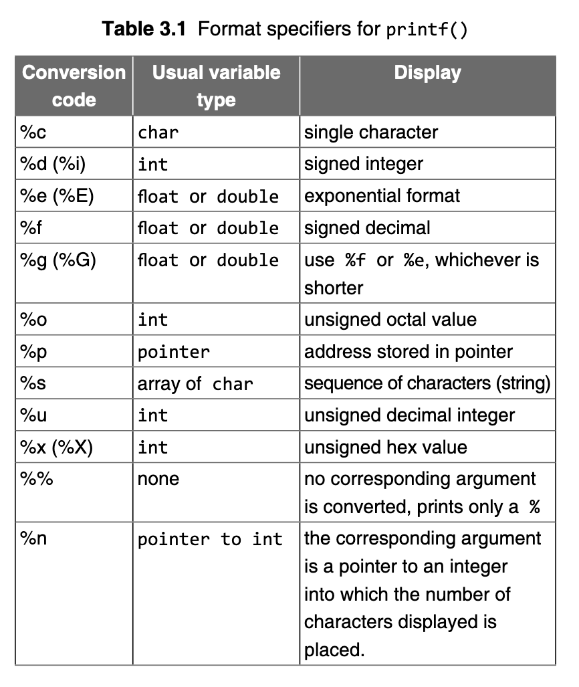

# Day 12

In the Name of Allah, The Hidden One, Knower of the Hidden


## Formatted I/O Functions

When talking of formatted I/O, we use functions like: `scanf` and `printf`[^1].

The `scanf()` function allows users to read input in a specified format, and the `printf()` function formatted output.


### Formatted Output

For the function: `printf()`, the first parameter is always a control string. This string is displayed on `stdout`. The general form to call `printf` is:

```c
printf(“control_string”, variable1, variable2, variable3, ...);
```

where the `...` means a list of variables that can be written separated by commas and this list may be as long as is desired.

The control string is all-important because it specifies the type of each variable in the list and how the user wants it printed. The control string is also called the **format string**

The control string contains _format specifiers_, which are special symbols that act like placeholders and references for the function to know where to put the data that is to be formatted within the output string. They are usually in the form of characters that follow a `%` sign.

Here's a list of format specifiers:




Examples using these format specifiers:

```c
#include<stdio.h>

int main() {
	printf("The Number after 6 is: %d\n", 7);
	printf("Floating Point number: %f\n", 3.14);
	printf("Single character: %c\n", 'a');
}
```

Output:

```
The Number after 6 is: 7
Floating Point number: 3.14
Single character: a
```


The C view of output is at a lower level than one might expect. The `%d` is known as a format specifier, while it also acts as a conversion code. **It indicates the data type of the variable to be printed and how that data type should be converted to the characters that appear on the screen**.

If by some accident the variable that is to be displayed happens to be a `float` or a `double`, then the user will still see a value displayed but it will not correspond to the actual value of the `float` or a `double`.

This is because:

- An int uses two bytes (considering _16-bit_ machine) to store its value, while a float uses four and a double uses eight. If an effort is made to display a float or a double using `%d`, then only the first two bytes of the value are actually used.

- Even if there was no size difference, int, float, and double use a different binary representation and `%d` expects the bit pattern to be a simple **signed binary integer**.


The format string in `printf()`, enclosed in quotation marks, has three types of objects:

- Ordinary characters: these are copied to output.

- Conversion specifier field: denoted by % containing the codes listed in Table 3.1 and by optional modifiers such as width, precision, flag, and size.

- Control code: optional control characters such as `\n`, `\b`, and `\t`

> The rest of the section is too confusing, will get back to format strings later :P


### Input using `scanf`

The `scanf()` function works in much the same way as the
`printf()`. It has the general form:

```c
scanf("control_string", variable1_address,  variable2_address...);
```

where the _control string_, also known as _format string_ is a list of format specifiers indicating the format and type of data to be read from the standard input device, which is the keyboard, and stored in the corresponding address of variables. _There must be the same number of format specifiers and addresses as there are input fields._


> Refer to documentation and book for more information on format specifiers.


[^1]: These functions are defined under the `stdio.h` header file.
