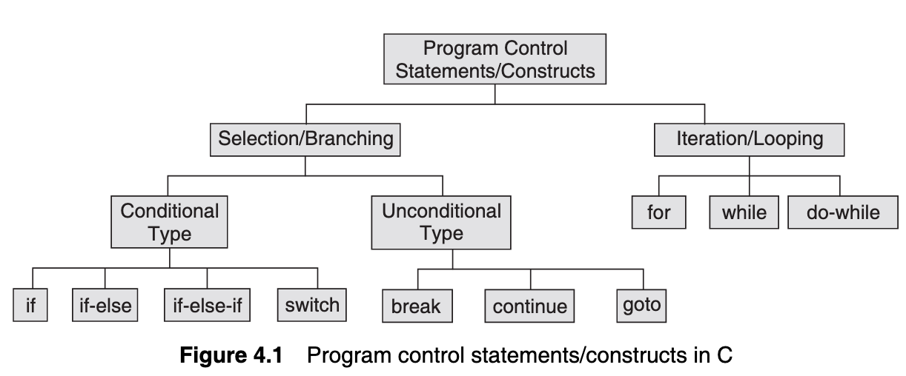
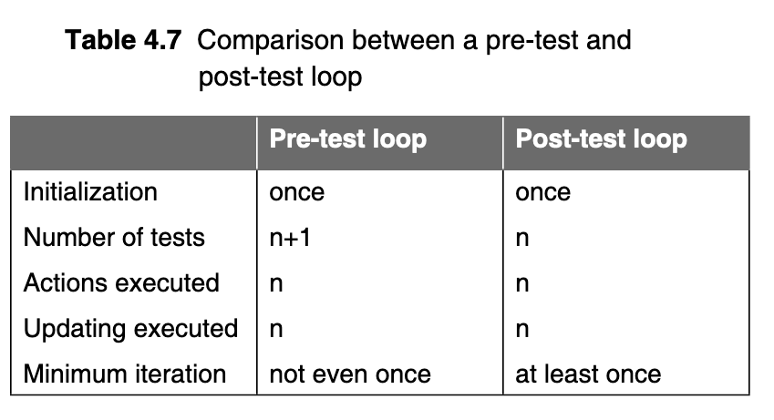

# Day 13

In the Name of Allah, The All-Encompassing, the Boundless, The Absolute Truth.

This day marks the beginning of a new chapter!
> This is where the fun begins (.... I think)

## Control Statements in C

In C, any sequence of statements can be grouped together to function as a syntactically equivalent single statement by enclosing the sequence in braces (i.e. `{` and `}`)

This grouping is known as _statement block_ or _compound statement_. Compound statements were originally designed
to make control structures simpler.

Every function has a function body consisting of a set of one or more statements, i.e., a statement block. For that reason, every function body including `main()` is confined within a set of curly braces and may optionally include variable declarations after the open curly brace. _Inside a function, execution proceeds from one statement to the next, top to bottom._

***Definition***: _The order in which statements are executed in a running program is called the flow of control._

Controlling the flow of a program is a very important aspect of programming. Control flow relates to the order in which the operations of a program are executed.

The control statements include _selection_, _iteration_, and _jump_ statements that work together to direct program flow.

A _selection_ statement is a control statement that allows choosing between two or more execution paths in a program. The selection statements in C are the `if` statement, the `if-else` statement, and the `switch` statement. In a selection statement, each decision is based off of a _boolean expression_.

The programming mechanism that executes a series of statements repeatedly a given number of times, or until a particular condition is fulfilled, is called a _loop_. The construct used for loop is known as _iteration statement_ .C language offers three language elements to formulate iteration statements:
- `while`
- `do-while`
- `for`


_Jump statements_ transfer the control to another point of the program. Jump statements include `goto`, `break`, `continue` and `return`.




You can try and check the [`selection.c`](selection.c) file for a more practical example of the workings of _selection statements_.

To run code within a C file (on UNIX/LINUX/MacOS) you can use:

```console
$ gcc <path_to_file> -o <name_of_executable>
$ ./name_of_executable
```

For example:
```console
$ gcc selection.c -o selection
$ ./selection
```

#### The Dangling Else Problem

This classic problem occurs when there is no matching else for each if. To avoid this problem, the simple C rule is that always pair an else to the most recent unpaired if in the current block. Consider the following:

```c
if (TestExprA)
    if (TestExprB)
        stmtBT;
    else
        stmtAF;
```

If `TestExprA` is evaluated to true, then execution moves to the nested if and evaluates `TestExprB`. If `TestExprB` is evaluated to `true` then `stmtBT` will be executed. If `TestExprA` is evaluated to false, then `stmtAF` is executed. But in the code above, the else is automatically paired with the closest if. But, it is needed to associate an else with the outer if also. The solution is either of the following:

- Use of a _null else_
- Use of braces to enclose the _true_ action of the second if

> An "else" always associates with the immediately preceding "if"

#### The Conditional Operator

C has a very handy conditional operator that can sometimes be used to omit if statements. It has a very simple format:

```c
expr1 ? expr2 : expr3
```

It executes by first evaluating `expr1`, which is normally a relational expression, and then evaluates either `expr2`, if the first result was `true`, or `expr3`, if the first result was `false`.

It is important to note that the `?:` operator has a very low precedence, i.e., it is usually applied last.

### The `switch` Statement

The general format of a switch statement is:

```c
switch(expr) {
case constant1: stmtList1;
    break;

case constant2: stmtList2;
    break;

case constant3: stmtList3;
    break;

// ...
// ... More cases ...
// ...

default: stmtListn;
}
```


When there is a `switch` statement, it evaluates the expression and then looks for a matching `case` label. If none is found, the `default` label is used. If no `default` is found, the statement does nothing.

**NOTE**: _A default case is not required but it is good programming practice to include one._

It is important to note that a switch statement is usually more efficient than nested `if`s.


## Iteration and Repetitive Execution

A _loop_ allows one to execute a statement or block of statements repeatedly. There are mainly two types of iterations or loops:

- _unbounded_ iteration/loop
- _bounded_ iteration/loop.

In _bounded iteration_, repetition is implemented by constructs that allow a determinate number of iterations. That is, bounded loops should be used when _we know, ahead of time, how many times we need to loop_. C provides the `for` construct as bounded loop.

_Unbounded iteration_  is mainly for when we don't know how many times we need to loop. C provides two types of unbounded loop: `while` loop and `do...while` loop. These types of loops are also known as _indeterminate_ or _indefinite_ loop. A loop can either be a _pre-test_ loop or be a _post-test_ loop. In a _pre-test_ loop, the condition is checked before the beginning of each iteration. In the _post-test_ loop, the code is always executed once.

C has three loop constructs: `while`, `for`, and `do-while`. The first two are _pre-test_ loops and `do-while` is a _post-test_ loop.

In addition to the _test expression_, two other processes are associated with almost all loops. These are _initialisation_ and _updating_. The _test expression_ always involves a variable, which is known as a _loop control variable_. _Initialisation_ is something that initialises the loop. That is the statement that assigns the initial value of the loop control variable. Now, how can the _test expression_, that controls the loop, be true for a while then changes to false? The answer is that something must happen inside the loop so that the _test expression_ becomes false.

The action that changes the test expression from true to false so that the loop is terminated is the updating statement. This involves updating the value of the control variable. Updating is done in each iteration.



### The `while` construct

`while` statement is a _pre-test_ loop. It uses a _test expression_ to control the loop. Since it is a _pre-test_ loop, it evaluates the test expression before every iteration of the loop.

The general format for a `while` loop is:

```c
while (test_expression) {
    // ...
    // Loop Body
    // ...
}
```

If initially, `test_expression` is true, the loop body will be executed until the value of `test_expression` becomes 0.

### The `for` construct

A loop formed by using the `for` statement is generally called a determinate or de finite loop because the programmer knows exactly how many times it will repeat. The number of repetitions can be determined mathematically by manually checking the logic of the loop. The general form of the for statement is as follows:

```c
for (initialization; test_expression; updating) {
    // ...
    // Loop Body
    // ...
}
```

- **Initialisation**: This part of the loop is the first to be executed. The statement(s) of this part are executed only once. This statement involves a loop control variable.

- **test_expression**: `test_expression` represents a test expression that must be true for the loop to continue execution.

- **Updating**: The statements contained here are executed every time through the loop before the loop condition is tested. This statement also involves a loop control variable.


### The `do-while` construct

The general form for a `do-while` loop is:

```c
do {
    // do something...
    statement; /* body of statements would be placed here */
} while(condition);
```

Since the `do-while` loop has he test expression at the end of the loop, _it is guaranteed that the body of the loop will execute at least once._


## The `goto` statement

When this statement is used, the control is **unconditionally** transferred to the statement associated with the label specified in the `goto` statement.

The `goto` statement's usage is:

```c
goto label_name;
```

Because the goto statement can interfere with the normal sequence of processing, it makes a program more difficult to read and maintain. Often, a `break` statement, a `continue` statement, or a function call can eliminate the need for a goto statement.

A statement label is defined in exactly the same way as a variable name, which is a sequence of letters and digits, the first of which must be a letter. The statement label must be followed by a colon `:`. Like other statements, the goto statement ends with a semicolon.


There are certain control statements, which terminate either a loop or a function. There are three such statements namely: `return`, `break`, and `continue`.

**return statements**: The `return` type is used in the definition of a function to set its returned value and the `return` statement is used to terminate execution of the function. The `return` statement has two forms. Functions with return type `void` use the following form:

```c
return;
```

Functions with `non-void` return type use the following form:

```c
return expression;
```

Here, `expression` yields the desired return value. _This value must be convertible to the return type declared for the function._

**break statements**: The `break` statement is used in loop constructs such as for, `while` and `do-while`, and `switch` statement to terminate execution of the loop or switch statement. The form of a break statement is:

```c
break;
```

It is important to note that after a `break` statement is executed within a loop or a case in a `switch` construct, _execution proceeds to the statement that follows the loop construct or switch statement_.

**continue statements**: The `continue` statement does not terminate the loop but goes to the test expression in the `while` and `do-while` statements and then goes to the updating expression in a `for` statement. It has the following form:

```c
continue;
```
