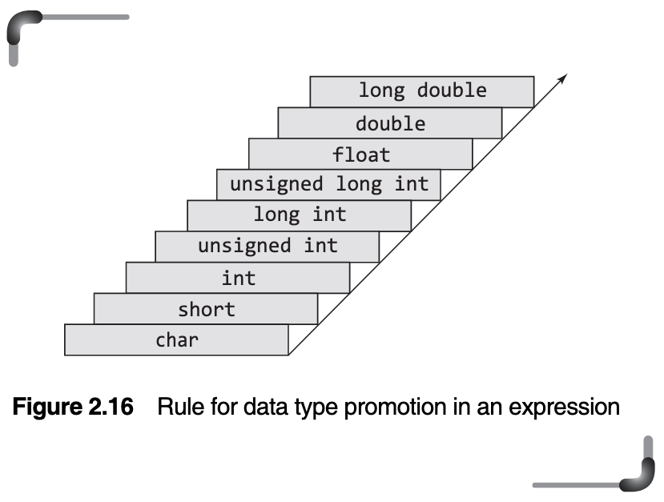
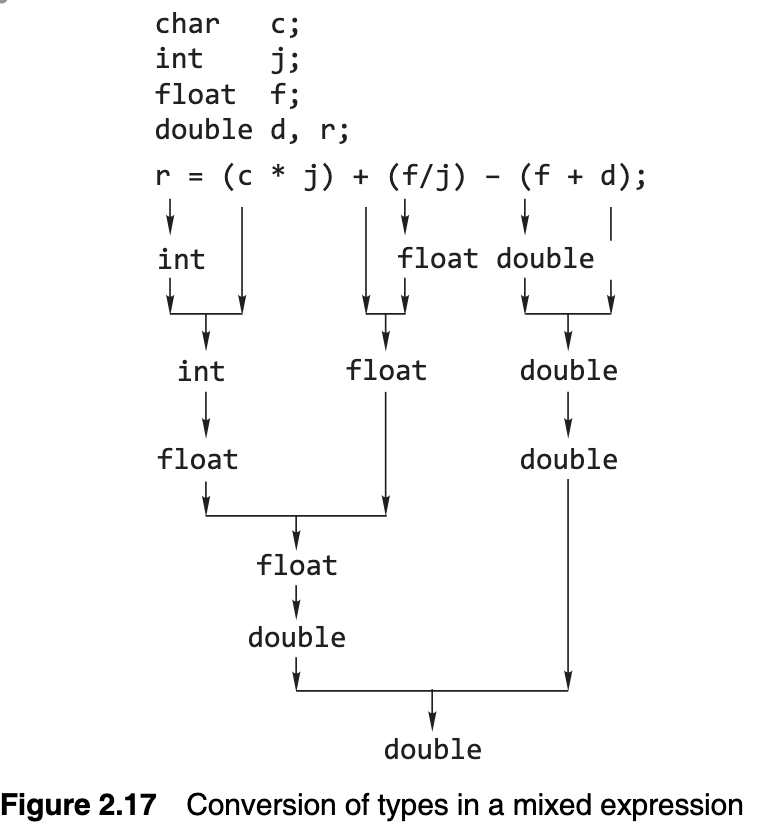

# Day 10

In the Name of Allah, The Forbearing, The Patient

## Type Conversion in Expressions

What if the variables of an expression are of different types? In that case, _the expression has the same data type as that of the variable with the largest size data type, present in it._
Thus, an expression containing anint and a char evaluates to type int, an expression containing a long and a float evaluates to type float, and so on. 

Within expressions, individual operands are promoted as necessary to match the associated operands in the expression. Operands are promoted in pairs for each binary operator in the expression. If both operands are of the same type, promotion is not needed. 

If they are not, promotion follows these rules:

- float operands are converted to double.
- char or short (signed or unsigned) are converted to int (signed or unsigned).
- If any one operand is double, the other operand is also converted to double, and that is the type of the result; or
- If any one operand islong, the other operand is treated as long, and that is the type of the result;
- If any one operand is of type unsigned, the other operand is converted to unsigned, and that is the type of the result; or the only remaining possibility is that
- Both operands must be int, and that is also the type of the result

### Conversion by Assignment

If `f` is a _float_ type and `i` is an _int_ type, `i` is promoted to float type in this assignment statement:

	f = i;

In contrast, the assignment statement

	i = f;

causes `f` to be demoted to type _int_. Its fractional part is lost on assignment to `i`.

***Conversions of characters and integers***:

There are six basic methods of converting values from one type to another. The methods are:

1. **Sign Extension**: This technique is adopted when converting a signed object to a wider signed object. e.g converting a `short int` to a `long int`. _It preserves the numerical value by filling the extra leading space with 1’s or 0’s._
2. 
2. **Zero Extension**: This is used when converting an `unsigned` object to a wider `unsigned` object. _It works by simply prefixing the value with the relevant number of zeroes_.

3. **Preserve low order data - truncate**: This is used when converting an object to a narrower form. Significant information may be lost.

4. **Preserve bit pattern**: This is used when converting between signed and unsigned objects of the same width.

5. **Internal conversion**: This uses special hardware to convert between floating point types and from integral to floating point types.

6. **Truncate at decimal point**: This is used to convert from floating point types to integral types, it may involve loss of significant information.

> There's some more stuff about type conversion, skipping because it's too repetitive and hardly comes up. 

### Casting Arithmetic Expressions

***Definition***: _Typecasting, or type conversion, is a method of changing an entity from one data type to another._

or example, if `i` is a type `int`, the expression:

	(float)i

casts `i` to float type. In other words, the program makes an internal copy of the value of `i` in _floating point format_

The most common use is to avoid losing the fractional part of the answer in an integer division.

### Working with Complex Numbers

A complex number is a number with a _real part_ and an _imaginary part_. It is of the form `a + bi` where `i` is the _square root of minus one_, and `a` and `b` are real numbers. `a` is the _real part_, and `bi` is the _imaginary part_ of the complex number. A complex number can also be regarded as an ordered pair of real numbers `(a, b)`.

According to C99, three complex types are supported:

- float complex
- double complex
- long double complex

C99 implementations support three imaginary types also:

- float imaginary
- double imaginary
- long double imaginary

To use the complex types, the `complex.h` header file must be included. The `complex.h` header file defines some macros and several functions that accept complex numbers and return complex numbers. In particular, the macro `I` represents the square root of –1.

> This concludes the second chapter :)