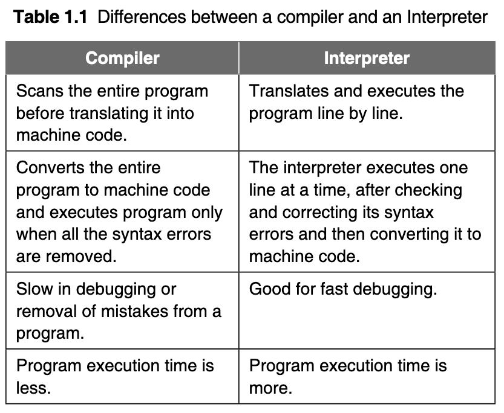
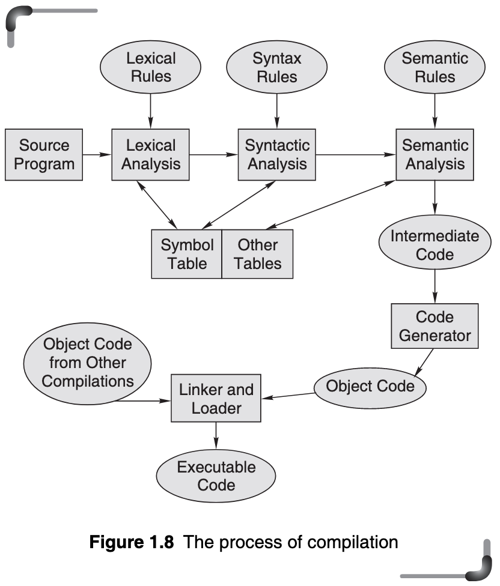
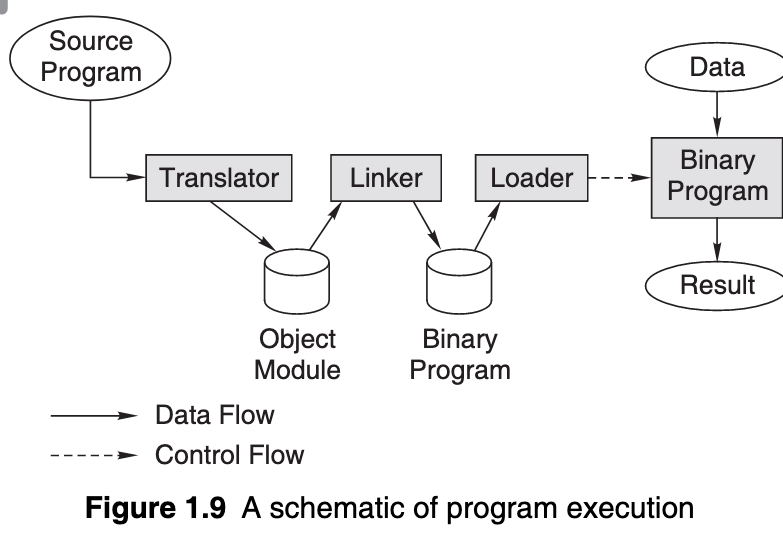

# Day 2

In the name of Allah, The most Powerful, The Most Beneficent.

The last time, I left my notes to the topic of: `Assembly Language`.
I will now continue with the next topic, i.e. `High-level Languages` :smile:

### High-level programming languages:

Such languages have instructions that are similar to human languages and have a set grammar that makes it easy for a programmer to write programs and identify and correct errors in them.

In more precise words:

    _High level programming languages have a high level of abstraction._


**Advantages** of High level programming languages:

- Readability
- Portability
- Easy Debugging
- Ease in development of Software


High-level programming languages solved many of the problems faced by low-level programming languages, however it doesn't mean that low-level programming languages no longer have any use.

Always remember, a programming is just yet another tool in the tool-belt of the programmer.


## Compilers, Intepreters Loaders, and Linkers.

***Definition***: _A compiler is a piece of software that translates high-level code into machine code._

Here's a simple diagram of what a compiler does

```
     _____________       __________
    | Source Code | --> | Compiler |
     ————————–––––       ————————––
                            |
                            |
                            V
                        __________________
                       | Object Code in   |  
                       | Machine Language |
                        ————————––––––––––
```

***Definition***: _During the process of translation, the compiler reads the source program statement- wise and checks for syntax errors. In case of any error, the computer generates a printout of the same. This action is known as_ **diagnostics**.

The diagnostics is the most crucial part, since it ensures the proper execution of the program without errors.

There is another type of software that also does
translation. This is called an *interpreter*.

Here are the differences between a compiler and an intepreter:




### Compiling and Executing high-level Languages

As discussed in previous topics, the compiling process involves 2 basic processes:
- Diagnostics
- Conversion to object code

The analysis/diagnostics phase uses the precise description of the source programming language. A source language is described using  _lexical rules, syntax rules_, and _semantic rules_.


Here's a short discription for each of these rules:

+ Lexical rules specify the valid syntactic elements or words of the language.

+ Syntax rules specify the way in which valid syntactic elements are combined to form the statements of the language. Syntax rules are often described using a notation known as **BNF (Backus Naur Form) grammar.**[^1]

+ Semantic rules assign meanings to valid statements of the language.

A more simpler discription for `syntax rules`:
> Check's if the programming language's "grammar" is all right and not gibberish.

The following diagram shows the process for compilation:




The first block is thelexical analyzer. It takes successive lines of a program and breaks them into individual lexical items namely, identifier, operator delimiter, etc (i.e. *tokens*). and attaches a type tag to each of these. Beide this, it constructs a *symbol table*[^2] for each identifier and finds the internal representation of each constant.

The symbol table is used later to allocate memory to each variable

The second stage of translation is called _syntax analysis_ or _parsing_. In this phase, expressions, declarations, and other statements are identified by using the results of lexical analysis. In the semantic analysis phase, the syntactic units recognized by the syntax analyzer are processed. An intermediate representation of the final machine language code is produced.


The last phase of translation is _code generation_, when optimization to reduce the length of machine language program is carried out. The output of the code generator is a machine level language program for the specified computer.

If a subprogram library is used or if some subroutines are separately translated and compiled, a final linking and loading step is needed to produce the complete machine language program in an executable form. If subroutines were compiled separately, then the address allocation of the resulting machine language instructions would not be final. When all routines are connected and placed together in the main memory, suitable memory addresses are allocated. The linker’s job is to find the correct main memory locations of the final executable program.

The loader then places the executable program in memory at its correct address.

Therefore, the execution of a program written in high-level language involves the following steps:  
1. Translation of the program resulting in the object program.  
2. Linking of the translated program with other object programs needed for execution, thereby resulting in a binary program.  
3. Relocation of the program to execute from the specific memory area allocated to it.
4. Loading of the program in the memory for the purpose of execution.


### Linkers

Linking resolves symbolic references between object programs. It is just as the name of the process suggests, linking "links" the symbol table generated by the compiler to the object program(s). In other words, **it makes object programs known to each other.**

In C, files are translated separately. Thus, only function calls that cross file boundaries and references to global data require linking.

This process is important because it makes sure the control transfer between main and subprograms has a definite pathway/channel to work with.


***Definition***: **Relocation** _means adjustment of all address-dependent locations, such as address constant, to correspond to the allocated space, which means simple modification of the object program   so that it can be loaded at an address different from the location originally specified._

+ It refers to the adjustment of address fields. The task of relocation is to add some constant value to each relative address in the memory segment.


Relocation is significant in the case where a linked file as well as the files linked to it by the linker move across file-structures or addresses. _Dynamic linking_[^3], unlike _static linking_[^4], makes use of dynamic addressing and locating techniques which also make use of _relocation_.


### Loaders

***Definition***: _Loading means physically placing the machine instructions and data into main memory, also known as primary storage area._

A loader performs the following functions:
- Assignment of load-time storage area to the program (i.e. load-time memory it can use)
- Loading the program into assigned space/storage.
- Relocation of program to execute properly from its load time storage area. (i.e relocating program for proper execution from assigned memory)
- Linking of main programs and subprograms.

The Loader, in short, performs the tasks of:         

            Memory assignment at load-time, Loading, Relocation, and Linking

The following figure from the textbook shows an excellent representation of how a program is executed.




Thus, a loader is a program that places a program’s instructions and data into primary storage locations. 

+ An absolute loader places these items into the precise locations indicated in the machine language program. 
+ A relocating loader may load a program at various places in primary storage depending on the availability of primary storage area at the time of loading.

A program may be relocated dynamically with the help of a relocating register. The base address of the program in primary storage is placed in the relocating register. The contents of the relocation register are added to each address developed by a running program.

The user is able to execute the program as if it begins at location zero. At execution time, as the program runs, all address references involve the relocation register. This allows the program to reside in memory locations other than those for which it was translated to occupy


I will end Day 2, on this topic. :)


[^1]: _In [computer science](https://en.wikipedia.org/wiki/Computer_science "Computer science"), **Backus–Naur form** or **Backus normal form** (**BNF**) is a [metasyntax](https://en.wikipedia.org/wiki/Metasyntax "Metasyntax") notation for [context-free grammars](https://en.wikipedia.org/wiki/Context-free_grammar "Context-free grammar"), often used to describe the [syntax](https://en.wikipedia.org/wiki/Syntax_%28programming_languages%29 "Syntax (programming languages)") of [languages](https://en.wikipedia.org/wiki/Formal_language#Programming_languages "Formal language") used in computing, such as computer [programming languages](https://en.wikipedia.org/wiki/Programming_language "Programming language"), [document formats](https://en.wikipedia.org/wiki/Document_format "Document format"), [instruction sets](https://en.wikipedia.org/wiki/Instruction_set "Instruction set") and [communication protocols](https://en.wikipedia.org/wiki/Communication_protocol "Communication protocol"). They are applied wherever exact descriptions of languages are needed: for instance, in official language specifications, in manuals, and in textbooks on programming language theory._ - (Credit: Wikipedia user [95.223.73.54](https://en.wikipedia.org/wiki/Special:Contributions/95.223.73.54 "Special:Contributions/95.223.73.54")  edited at 10:40, 10 January 2022)

[^2]: _Symbol table is an important data structure created and maintained by compilers in order to store information about the occurrence of various entities such as variable names, function names, objects, classes, interfaces, etc. Symbol table is used by both the analysis and the synthesis parts of a compiler._

[^3]: The executable code still contains undefined symbols, plus a list of objects or libraries that will provide definitions for these. Loading the program will load these objects/libraries as well, and perform a final linking. - ( Source: [wikipedia](https://en.wikipedia.org/wiki/Linker_(computing)#Dynamic_linking) )

[^4]: Static linking is the result of the linker copying all library routines used in the program into the executable image. This may require more disk space and memory than dynamic linking, but is more portable, since it does not require the presence of the [library](https://en.wikipedia.org/wiki/Dynamic-link_library "Dynamic-link library") on the system where it runs. - ( Source: [wikipedia](https://en.wikipedia.org/wiki/Linker_(computing)#Static_linking) )
