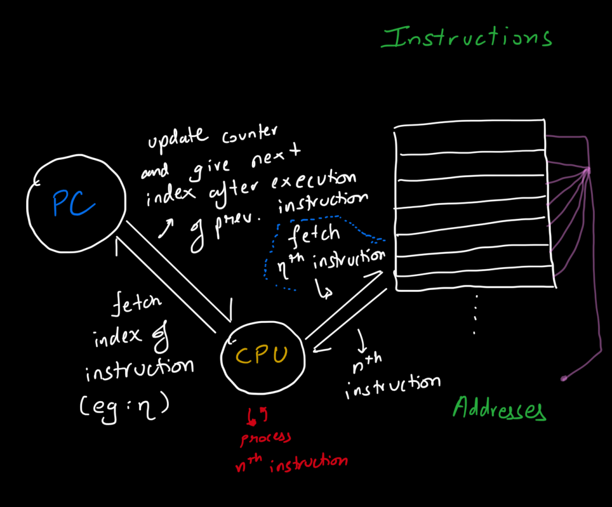
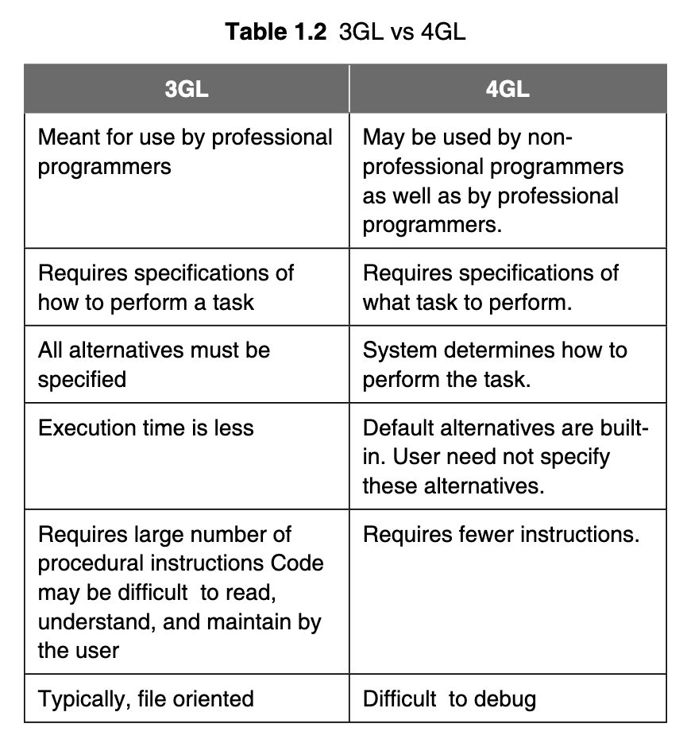

# Day: 3

In the name of Allah, The Creator, The Fashioner

> Welcome to Day 3! \
> Glad you could bare to read some more of this >.>

## Program Execution

_The primary memory of a computer, also called the Random Access Memory, is divided into units known as_ **words**.

Depending on the computer, a word of memory maybe **2**, **4**, or even **8** bytes in size. Each word is associated with a unique address, which is a positive integer that helps the CPU to access the word.

Addresses increase consecutively from the top of the memory to its bottom.

> So it's similar to how water pressure increases, the lower  you are, higher the value. 🤔

When a program is compiled and linked, each instruction and each item of data is assigned an address. At execution time, the CPU finds instructions and data from these addresses.

The PC, or program counter, is a CPU register that holds the address of the next instruction to be executed in a program.

> Maybe it helps to think that the "PC" is analogous to the dummy variable used when looping. It holds the iteration's counter, a reference for the "loop" to check what step it is at.

The PC holds the 0th address at the beginning of the program execution.

The CPU fetches the next instruction and increments the PC. After the execution of the instruction, the CPU then check the PC and fetches the corresponding instruction, repeating this until the program exits.

This instruction may not necessarily be in the next memory location. It could be at quite a different address.

The CPU fetches the contents of the words addressed by the PC in the same amount of time, whatever their physical locations. The CPU has random access capability to any and all words of the memory, no matter what their addresses. Program execution proceeds in this way until the CPU has processed the last instruction.

Here's a "neat" diagram showing how this happens:

## Fourth Generation Programming Languages (4GL)

> This is kinda a trivia topic, so skip if you find it boring :3

_The Fourth Generation Language is a non-procedural language that allows the user to simply specify what the output should be without describing how data should be processed to produce the result._

End user-oriented 4GLs are designed for applications that process low data volumes.

Some fourth generation languages are used to produce complex printed reports. These languages contain certain types of programs called **generators**. With a report generator, the programmer specifies the headings, detailed data, and totals needed in a report. Thus, the report generator produces the required report using data from a file.

**Advantages of 4GLs:**
- Increased Productivity
- Faster system development.
- Easier program maintenance.
- End-users can develop their own applications.
- More portable compared to previous generation languages.
- Documentation is of better order, since most 4GLs are self-documenting.

Here are the differences between 3GLs and 4GLs.

## Fifth Generation Languages (5GLs)

Natural languages represent the next step in the development of programming languages belonging to fifth generation languages. Natural language is similar to query language, with one difference: _it eliminates the need for the user or programmer to learn a specific vocabulary, grammar, or syntax_. The text of a natural- language statement resembles human speech closely.

Natural languages already available for microcomputers include CLOUT, Q & A, and SAVY RETRIEVER (for use with databases) and HAL(Human Access Language) for use with LOTUS.

That's all I have time for today

> \**sigh\**
