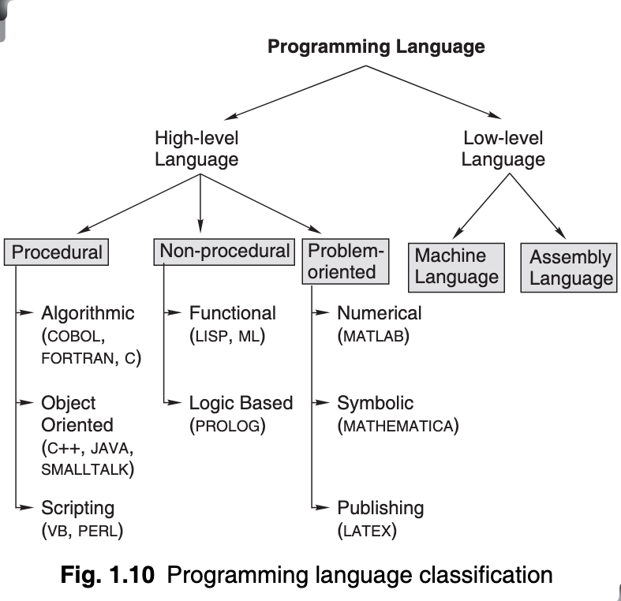

# Day 4

In the name of Allah, The Glorious, The Most Honourable

## Classification of Programming Languages

### Procedural Languages

**Algorithmic Languages** :
+ These are high-level languages designed for forming convenient expression of procedures, used in the solution of a wide class of problems. In this language, the programmer must specify the steps the computer has to follow while executing a program.

+ Examples include:
    + C
    + FORTRAN
    + COBOL

**Object-Oriented Languages**:
+ The basic philosophy of object-oriented programming is to deal with objects rather than functions or subroutines as in strictly algorithmic language.

+ _Objects are self-contained modules that contain data as well as the functions needed to manipulate the data within the same module._

+ In a conventional programming language, data and subroutines or functions are separate, however, in object-oriented programming, subroutines as well as data are locally defined in objects.

+ _The most important features of Object-Oriented Programming are[^1]:_
    + Abstraction
    + Polymorphism
    + Inheritance
    + Reusable Code
    + Encapsulation

+ Examples of Object Oriented Programming include:
    + C++
    + Java
    + SMALLTALK

**Scripting Language**:
+ These languages assume that a collection of useful programs, each performing a task, already exists.

+ A scripting language may thus be thought of as a glue language, which sticks a variety of components together. One of the earliest scripting languages is the UNIX shell. Now there are several scripting languages such as VB script and Perl.

**Problem-oriented languages**:

_These are not under the classification of "Procedural Languages"_

+ These are high-level languages designed for developing a convenient expression of a given class of problems.

### Non-Procedural Languages

**Functional languages**:
+ The functional programming style relies on the idea of function application rather than on the notion of variables and assignments. A program written in a functional language consists of function calls together with arguments to functions.

+ Some examples include:
    + LISP
    + ML

**Logic-based Programming Languages**:
+ A logic program is expressed as a set of atomic sentences, known as fact, and horn clauses, such as if-then rules.

+ Example: PROLOG

## Structured Programming Concept

In simple words, Structured programming is:

- Concerned with improving the programming process through better organisation of programs and better programming notation to facilitate correct and clear description of data and control structure.

- Concerned with improved programming languages and organised programming techniques which should be understandable and therefore, more easily modifiable and suitable for documentation.

- More economical to run because good organisation and notation make it easier for an optimising compiler to understand the program logic.

- More correct and therefore more easily debugged, because general correctness theorems dealing with structures can be applied to proving the correctness of programs.

### Top-Down Analysis

The for this kind of analysis is to essentially subdivide a large problem into several smaller tasks or parts for ease of analysis, and then creating a hierarchy of tasks to be solved.

The top-down analysis doesn't stop at just dividing the problem into two simpler problems. It _recursively_ divides the subproblems into smaller and simpler problems until no further division is possible.

The problems are then solved in the reverse order, i.e. solving the simplest first and moving on to the next most simple subproblem.

### Modular Programming

Modular programming is a program that is divided into logically independent smaller sections, which can be written separately. In simpler words, it's like breaking the _program_ into simpler "modules" or "parts" or "cogs" that can be put in whatever order and place it suits the program, so as to solve the problem at hand.

- A module consists of a series of program instructions or statements in some programming language.
- A module is clearly terminated by some special markers required by the syntax of the language.
- A module has a special _unique_ name.
- A module has _only one entry point_ to which control is transferred from the outside and only one exit point from which control is returned to the calling module.

The following are some advantages of modular programming:

+ Complex programs may be divided into simpler and more _manageable_ elements.
+ Simultaneous coding of different modules by several programmers is possible.
+ A library of modules may be created, and these modules may be used in other programs as and when needed.
+ The location of program errors may be traced to a particular module; thus, _debugging and maintenance may be simplified_.

> Skipping "Structured Code" since it doesn't have anything worth noting. \
>
> Same for "The Process of Programming" and "Different Ways of Stating Algorithms"

## Algorithms

    Algorithm = Program + Data

***Definition***: _An algorithm is ‘an effective procedure for solving a problem in a finite number of steps’._

A well-designed algorithm will always provide an answer; it may not be the desired answer but there will be an answer. It may be that the answer is that there is no answer. **A well-designed algorithm is also guaranteed to terminate.**

There are four ways of stating algorithms. These are as follows:
+ Step-form
+ Pseudo-code
+ Flowchart
+ Nassi-Schneiderman[^2]

### Key Features of an Algorithm and the Step-form

The said key features are:
- Sequence (also known as process)
- Decision (also known as selection)
- Repetition (also known as iteration or looping)

**Sequence** _means that each step or process in the algorithm is executed in the specified order._

**Termination** _refers to the fact if the algorithm will ever halt. The analysis of termination and outcome of an algorithm is called "termination analysis"._

**Correctness** _means how easily its logic can be argued to meet the algorithm’s primary goal. This requires the algorithm to be made in such a way that all the elements in it are traceable to the requirements._

In other words, correctness is the degree to which an algorithm performs its specified function. _The most common measure of correctness is **defects per Kilo Lines of Code (KLOC)** that implements the algorithm, where defect is defined as the verified lack of conformance to requirements._

### Variables

It is known that data is a symbolic representation of value and that programs set the context that gives data a proper meaning. Almost every algorithm contains data and usually the data is ‘contained’ in what is called a variable.

*Data is a symbolic representation of value.*

*A variable, which has a name, is a container for a value that may vary during the execution of the program.*

### Subroutines

A simple program is a combination of statements that are implemented in a sequential order. A statement block is a group of statements.

There might be a specific block of statement, which is also known as a procedure, that is run several times at different points in the implementation sequence of the larger program.

A procedure that can be called arbitrarily anywhere is a subroutine.

***Definition***: _A subroutine, also known as procedure, method or function, is a portion of instruction that is invoked from within a larger program to perform a specific task._

The subroutine is relatively independent of the other statements of the larger program.

After completing the specific task, a subroutine returns to the point of invocation in the larger program.

> Moving to chapter two, since there's not much of importance in the next few topics.

[^1]: Check [Pillars of Object Oriented Programming](https://www.freecodecamp.org/news/four-pillars-of-object-oriented-programming/) - ( Credit to [freecodecamp.org](https://www.freecodecamp.org) )

[^2]: Nassi-Shneiderman diagrams are an alternative notation for process flowchart. A Nassi-Shneiderman (NS) diagram is a graphical method of stating algorithms. ( Reference: [wikipedia](https://en.wikipedia.org/wiki/Nassi%E2%80%93Shneiderman_diagram) )
