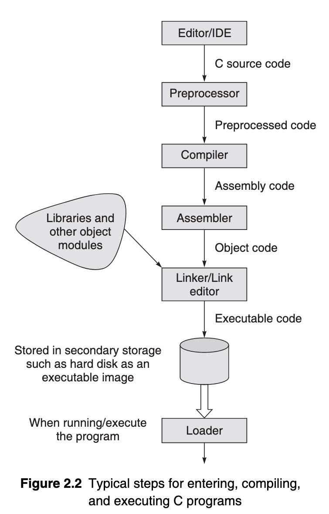

# Day 5

In the name of Allah, The First, The Last


## Basics Of C

> Skipping the starting portions, i.e. history and such, read if interested :P


The following figure shows how a C program is run:




The **Editor/IDE** part refers to the source code written by the programmer/user.

**Preprocessing** is the first phase of the C compilation. It processes include-files, conditional compilation instructions and macros.

To define a _C preprocessor directive_ we use:

```c
// Defining a preprocessor directive for boolean TRUE
#define True 1

// Similarly, we can define one for boolean FALSE as well
#define False 0
```


The preprocessor is invoked as the first part of your compiler program’s compilation step. _It is usually hidden from the programmer because it is run automatically by the compiler._


**Compilation** is the second pass. It takes the output of the preprocessor, the source code, and generates assembler source code.
The compiler examines each program statement contained in the source program and checks it to ensure that it conforms to the syntax and semantics of the language.


**Assembly** is the third stage of compilation. It takes the assembly source code and produces an assembly listing with offsets. The assembler output is then stored in an _object file_[^1]
The assembler takes each assembly language statement and converts it into a binary format known as object code, which is then written into another file on the system.


***NOTE***: For more information on object files and such, be sure to check information about the [ELF](https://en.wikipedia.org/wiki/Executable_and_Linkable_Format) format object code


**Linking** is the final stage of compilation. The purpose of the linking phase is to get the program into a final form for execution on the computer. The functions are the part of the standard C library, provided by every C compiler.
The program may use other source programs that were previously processed by the compiler. These functions are stored as separate object files which must be linked to our object file.


_The process of compiling and linking a program is often called building_

The final linked file, which is in an _executable object code_ format, is stored in another file on the system, ready to be run or executed.
If the program does not produce the desired results, it is necessary to go back and reanalyse the program. There are three kinds of errors:

- **Compile Errors**: These are given by the compiler and prevent the program from not running.
- **Linking Errors**: These are given by the linker or at runtime and ends the program.
- **Runtime errors**: These are given by the operating system.


_Removing errors from a program is called debugging._ Any type of error in your program is known as a **bug**.
_The **program state** is simply the set of values of all the variables at a given point in program execution._ It is a snapshot of the current state of computation.


For [UNIX](https://en.wikipedia.org/wiki/Unix) systems and the like, the default compiler is: [`cc`](http://www.nsc.ru/cgi-bin/www/unix_help/unix-man?cc+1). As for linux, the compiler is: [`gcc`](https://man7.org/linux/man-pages/man1/gcc.1.html)


To execute a C program, say: `program.c`, we can use something like so:
```console
unix-user@UNIX$ cc program.c

linux-user@linux$ gcc program.c
```

It is more convenient to use the `–o` argument and file name in the compilation as shown:

```console
user@system$ cc -o executable program.c
```

To execute the said executable produced by the compiler, we use:

```console
user@system$ $PATH_TO_EXECUTABLE/executable_name

#If the executable is in the same file as pwd, then:
user@system$ ./executable
```

> I believe it's best to end this day here. Next day,  I'll be starting the actual programming part of C

[^1]: The object code is usually [relocatable](https://en.wikipedia.org/wiki/Relocation_(computing)), and not usually directly [executable](https://en.wikipedia.org/wiki/Executable). There are various formats for object files, and the same machine code can be packaged in different object file formats. An object file may also work like a [shared library](https://en.wikipedia.org/wiki/Shared_library). (Source - [wikipedia](https://en.wikipedia.org/wiki/Object_file) ).
