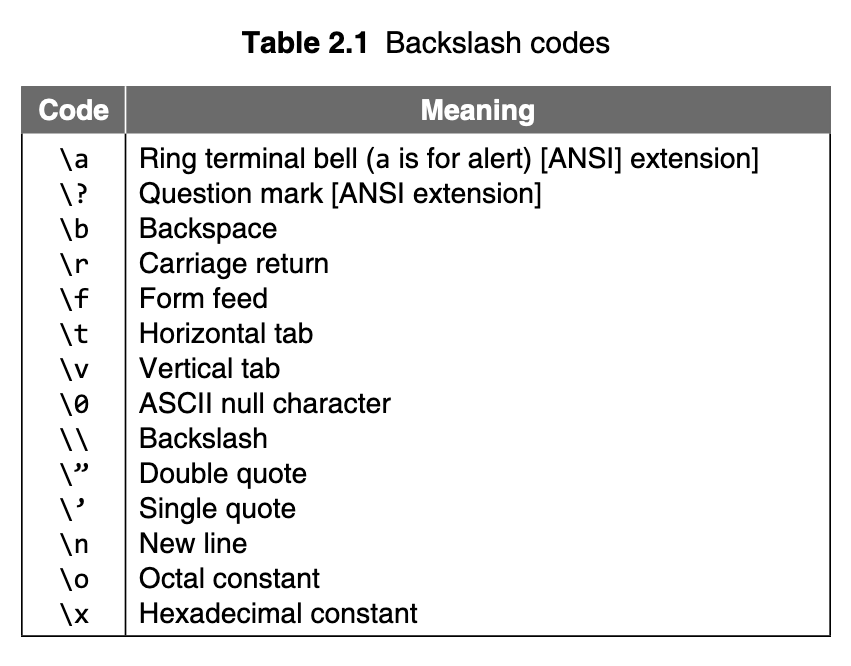

# Day 6

> Here's where things start getting fun :)

## A Simple C Program

```c
/* A Simple Hello-World program in C */

#include <stdio.h>

int main() {
    printf("Hello World!\n");
    return 0;
}
```

Here's a breakdown of the above program:

The first line, i.e. `/* A Simple Hello-World program in C */` is a comment line.
In C, the comments can be included in the program. The comment lines start with /* and terminate with */. These statements can be put anywhere in the program. _The compiler considers these as non-executable statements._

According to [`C99`](https://en.wikipedia.org/wiki/C99), a comment line can also begin with `//`.


```c
#include<stdio.h>
```

In C, all lines that begin with # are directives for the preprocessor, which means that all these directives will be processed before the program is actually compiled.

In this case, the file `stdio.h`[^1] is added in the source program before the actual compilation begin. `stdio.h`[^1] is a header file that contains IO functions like [`printf`](https://pubs.opengroup.org/onlinepubs/9699919799/functions/printf.html), etc.
It is also important to note that preprocessor statements are not terminated by a semicolon.

```c
int main()
```


Every C program contains a function called `main`. This is the starting point of the program. A C program may contain one or more functions one of which must be main().

Since `main()` is also a function from which control returns to the operating system at program termination, in ANSI C _it is customary, although not required, to include a statement in `main()` which explicitly returns control to the operating environmen._


```c
	{}
```

This is a _brace_. As the name implies, braces come in packs of two, i.e. for every open brace there must be a matching close. Braces allow me to lump pieces of program together. Such a lump of program is often called a _block_.

When the compiler sees the matching close brace at the end it knows that it has reached the end of the function and can look for another (if any).


```c
	printf("Hello World!\n");
```

`printf` is a ‘library function’. The \n (pronounced backslash n) in the string argument of the function `printf`. It is used to print the new line character and is an example of an _escape sequence_. 

> Think of an escape sequence as a ‘substitute character’ for outputting special characters or some positional action on the printing point, known as cursor, when the output device is a visual diaplay unit.


Here's the list of escape sequences available in C:



```c
	return 0;
```

This statement indicates that the value returned by the function `main`, after the program instructions in its body are executed, to the operating system is `0`.


Though the value, recognized by the OS as _status_, is returned using the return 0 statement, the OS may not always use it.

> The textbook does a bery nice job of summarising the program, although it's a bit different, it's more or less the same.


> I believe it's best to end this here. Will continue tomorrow :>


[^1]: Reference to the header file: [`stdio.h`](https://en.wikibooks.org/wiki/C_Programming/stdio.h/Function_reference)
