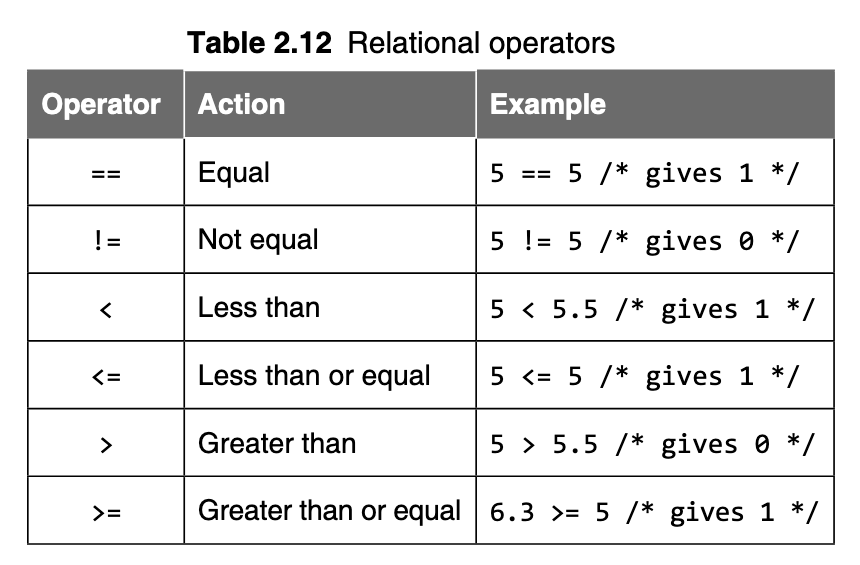
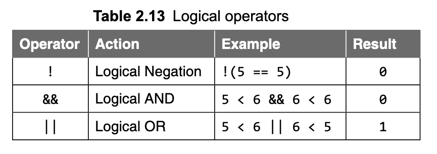
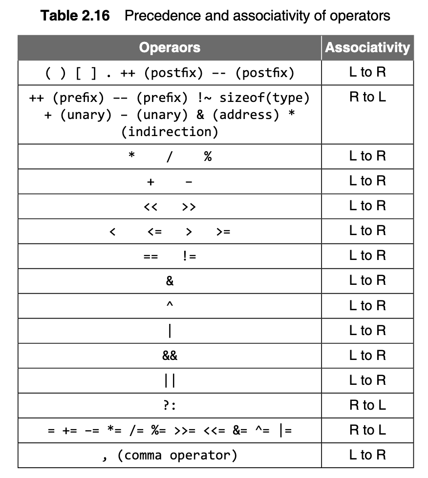
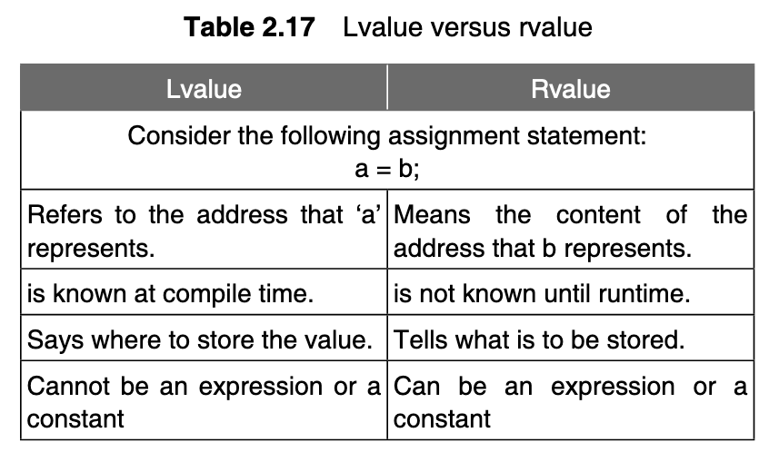

# Day 9

In the Name of Allah, The Light, The Illuminator

> I'll contineue from the where I last left, i.e. relational operators :)


### Relational Operators in C

C provides six relational operators for comparing numeric quantities. These are summarized in Table 2.12. **Relational operators evaluate to 1, representing the true outcome, or 0, representing the false outcome.**




### Logical Operators in C

**Like the relational operators, logical operators evaluate to 1 or 0.**

Logical _negation_ is a unary operator that negates the logical value of its single operand. If its operand is non-zero, it produces 0, and if it is 0, it produces 1.

Logical AND produces 0 if one or both its operands evaluate to 0. Otherwise, it produces 1. 

Logical OR produces 0 if both its operands evaluate to 0. Otherwise, it produces 1.




***NOTE***: _In general, any non-zero value can be used to represent the logical true, whereas only zero represents the logical false. C does not have a built-in Boolean type._

**Exceptions in the evaluation of logical expressions containing `&&` and `||`**: 

- If the left operand yields a false value, the right operand is not evaluated by a compiler in a logical expression using `&&`.
- If the left operand evaluates true value, the right operand is not evaluated by the compiler in a logical expression with the `||` operator.
- The operators `&&` and `||` have left to right associativity.

Hence the left operand is evaluated first and, depending on the output, the right operand may or may not be evaluated.

### Bitwise Operations in C

_Bitwise operators expect their operands to be integer quantities and treat them as bit sequences._

- **Bitwise negation** is a unary operator that complements the bits in its operands. 
- **Bitwise AND** compares the corresponding bits of its operands and produces a 1 when both bits are 1, and 0 otherwise. 
- **Bitwise OR** compares the corresponding bits of its operands and produces a 0 when both bits are 0, and 1 otherwise.
- **Bitwise Exclusive OR (XOR)** compares the corresponding bits of its operands and produces a 0 when both bits are 1 or both bits are 0, and 1 otherwise.


Bitwise left shift operator and bitwise right shift operator both take a bit sequence as their left operand and a positive integer quantity _n_ as their right operand. The former produces a bit sequence equal to the left operand but which has been shifted _n_ bit positions to the left. The latter produces a bit sequence equal to the left operand but which has been shifted _n_ bit positions to the right. Vacated bits at either end are set to 0.

The general form of the right shift statement is:
	
	variable_name >> number of bit positions; 

and that of the left shift statement is:

	variable_name << number of bit positions
	
### Conditional Operators in C

The conditional operator has three expressions. It has the general form:

	expression1 ? expression2 : expression3

***NOTE***: _This is also known as the **ternary operator**_

First, expression1 is evaluated;it is treated as a logical condition. If the result is non-zero, then expression2 is evaluated and its value is the final result. Otherwise, expression3 is evaluated and its value is the final result.

In simpler words, what the statement `means` is:

```pseudocode
if(expression1) then
	expression2
else
	expression3
```

### Comma Operator

This operator allows the evaluation of multiple expressions, separated by the comma, from left to right in order and the evaluated value of the rightmost expression is accepted as the final result.

The general form of an expression using a comma operator is:

	expressionM = (expression1, expression2, ..., expressionN);
	
where the expressions are evaluated strictly from left to right and their values discarded, except for the last one, whose type and value determine the result of the overall expression. 

Here, it may be stated that in the preceding general form, the left hand side expression, `expiressonN`, may be omitted.In such a case, the right hand side expressions exist and the comma operator evaluates these from left to right. Finally, the value of the last expression is returned as the outcome.

The comma operator forces all operations that appear to the left to be fully completed before proceeding to the right of the comma. This helps eliminate any inaccuracy in the evaluation of the expression.

### The `sizeof` Operator

C provides a useful operator, `sizeof`, for calculating the size of any data item or type. It takes a single operand that may be a _type name_ or an _expression_  and **returns the size of the specified entity in bytes**. _The outcome is totally machine-dependent._


### Expression Evaluation and Operator Precedence

The following table shows the precedence of operators in an expression, meaning, the operator of highest precedence is evaluated first. The precedence decreases as you go down the table.




### Lvalues and Rvalues

***Definition***: _An lvalue is an expression to which a value can be assigned._

***Definition***: _An rvalue can be defined as an expression that can be assigned to an lvalue._


The _lvalue_ expression is located on the left side of an assignment statement, whereas an _rvalue_ is located on the right side of an assignment statement.
The following table shows the differences between _lvalues_ and _rvalues_.



